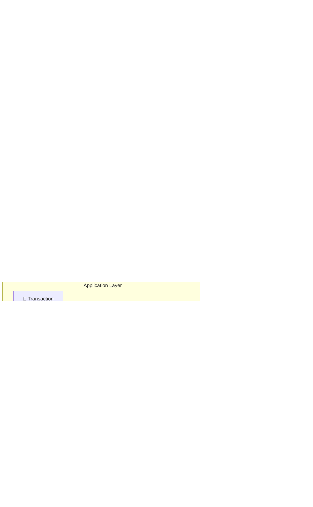
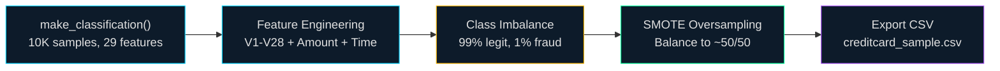
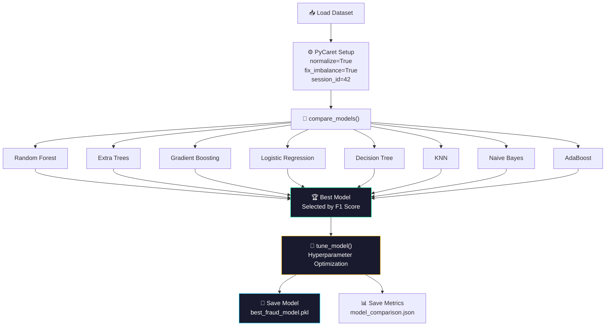
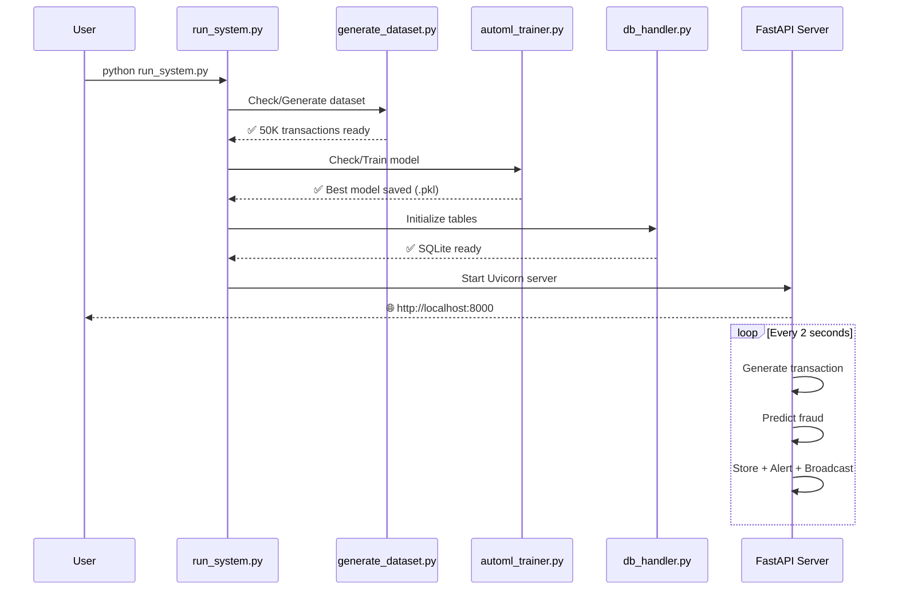

<p align="center">
  
  
  
  
  
</p>

<h1 align="center">🛡️ Secure180</h1>
<h3 align="center">Real-Time Credit Card Fraud Detection System with AutoML</h3>

<p align="center">
  <i>An end-to-end AI-powered fraud detection pipeline that generates synthetic transactions, trains models using AutoML (PyCaret), detects fraud in real-time via WebSockets, and visualizes everything on a live cyberpunk dashboard.</i>
</p>

---

## 📌 Table of Contents

- [Overview](#-overview)
- [System Architecture](#-system-architecture)
- [Data Pipeline](#-data-pipeline)
- [ML Pipeline](#-ml-pipeline)
- [Features](#-features)
- [Tech Stack](#-tech-stack)
- [Project Structure](#-project-structure)
- [Quick Start](#-quick-start)
- [API Reference](#-api-reference)
- [Dashboard](#-dashboard)
- [How It Works](#-how-it-works)
- [Contributing](#-contributing)
- [License](#-license)

---

## 🎯 Overview

**Secure180** is a complete real-time fraud detection system that simulates a production environment for credit card transaction monitoring. It combines **AutoML model training**, **real-time transaction simulation**, **instant fraud scoring**, and a **live cyberpunk-themed dashboard** — all in a single, self-contained application.

### Key Highlights

| Feature | Description |
|---------|-------------|
| 🤖 **AutoML Training** | PyCaret compares 8+ ML algorithms and selects the best one automatically |
| 📡 **Real-Time Streaming** | WebSocket-based live data feed — transactions every 2 seconds |
| 🚨 **Instant Alerts** | Color-coded terminal alerts + dashboard toast notifications |
| 🌐 **Interactive Globe** | 3D globe visualization showing fraud origin locations |
| 📊 **6 Live Charts** | Doughnut, line, radar, bar, hourly, and geospatial visualizations |
| ⚡ **Sub-100ms Detection** | Millisecond-level fraud scoring per transaction |
| 🗄️ **Persistent Storage** | SQLite database for transaction history and model metrics |

---

## 🏗️ System Architecture



---

## 🔄 Data Pipeline



---

## 🧠 ML Pipeline



### Model Comparison Metrics

| Metric | Description |
|--------|-------------|
| **F1 Score** | Primary selection criterion — harmonic mean of precision and recall |
| **AUC** | Area Under ROC Curve — overall discriminative ability |
| **Precision** | Ratio of true positives to predicted positives |
| **Recall** | Ratio of true positives to actual positives |
| **Accuracy** | Overall correct predictions |

---

## ✨ Features

### 🔬 Detection Engine
- **AutoML model selection** across 8 classification algorithms
- **Hyperparameter tuning** with F1 optimization
- **Three-tier risk classification**: LOW / MEDIUM / HIGH
- **Configurable thresholds** (fraud: 0.5, high-risk: 0.7)

### 📡 Real-Time Processing
- **WebSocket streaming** — live transaction feed to all connected clients
- **2-second intervals** — simulated transaction generation
- **Broadcast architecture** — multiple dashboard instances supported
- **Automatic stats refresh** — KPIs update every 5 transactions

### 📊 Dashboard Visualizations
- **Doughnut Chart** — Legit vs. fraud transaction ratio
- **Live Line Chart** — Streaming transaction amounts (last 60)
- **Radar Chart** — Fraud distribution by merchant category
- **Bar Chart** — Fraud rate per store category
- **3D Globe** — Geographic fraud origin visualization
- **Hourly Chart** — Fraud activity by hour of day

### 🚨 Alert System
- **Terminal alerts** with color-coded severity (🚨 RED / 🟡 YELLOW / ✅ GREEN)
- **Dashboard toast notifications** for fraud events
- **Persistent fraud log** file for audit trail
- **Risk-level badges** on all transaction records

---

## 🛠️ Tech Stack

| Component | Technology | Purpose |
|-----------|-----------|---------|
| **Backend** | FastAPI + Uvicorn | REST API + WebSocket server |
| **ML Engine** | PyCaret 3.3 | AutoML training and prediction |
| **Database** | SQLite + SQLAlchemy | Transaction & model storage |
| **Frontend** | Vanilla HTML/CSS/JS | Single-file cyberpunk dashboard |
| **Charts** | Chart.js 4.4 | Interactive data visualizations |
| **Globe** | Globe.gl | 3D geospatial fraud mapping |
| **Data Gen** | scikit-learn + imbalanced-learn | Synthetic dataset + SMOTE |
| **Streaming** | WebSockets | Real-time bi-directional communication |

---

## 📁 Project Structure

```
Secure360/
└── fraud_detection_system/
    ├── run_system.py              # 🚀 Main entry point — orchestrates everything
    ├── config.py                  # ⚙️ Global configuration (thresholds, paths)
    ├── requirements.txt           # 📦 Python dependencies
    │
    ├── api/
    │   ├── __init__.py
    │   └── main_api.py            # 🌐 FastAPI app — REST + WebSocket endpoints
    │
    ├── models/
    │   ├── __init__.py
    │   ├── automl_trainer.py      # 🤖 PyCaret AutoML training pipeline
    │   └── saved_model/
    │       └── best_fraud_model.pkl  # 💾 Trained model (generated)
    │
    ├── realtime/
    │   ├── __init__.py
    │   ├── fraud_detector.py      # 🛡️ Real-time prediction engine
    │   └── transaction_simulator.py # 🎲 Synthetic transaction generator
    │
    ├── database/
    │   ├── __init__.py
    │   ├── db_handler.py          # 🗄️ SQLite operations & queries
    │   └── fraud_detection.db     # 📀 Database file (generated)
    │
    ├── alerts/
    │   ├── __init__.py
    │   ├── alert_system.py        # 🚨 Terminal alerts & fraud logging
    │   └── fraud_alerts.log       # 📝 Fraud audit log (generated)
    │
    ├── data/
    │   ├── __init__.py
    │   ├── generate_dataset.py    # 📊 Synthetic data + SMOTE pipeline
    │   ├── creditcard_sample.csv  # 📁 Generated dataset (50K rows)
    │   └── model_comparison.json  # 📈 AutoML comparison results
    │
    └── dashboard/
        ├── __init__.py
        └── index.html             # 🎨 Cyberpunk dashboard (single file)
```

---

## 🚀 Quick Start

### Prerequisites

- **Python 3.10+** (required for PyCaret 3.x compatibility)
- **pip** package manager

### Installation

```bash
# 1. Clone the repository
git clone https://github.com/<your-username>/Secure360.git
cd Secure360/fraud_detection_system

# 2. Create virtual environment
python3 -m venv .venv
source .venv/bin/activate  # macOS/Linux
# .venv\Scripts\activate   # Windows

# 3. Install dependencies
pip install -r requirements.txt

# 4. Launch the system
python run_system.py
```

### What Happens on Launch



### Access Points

| Service | URL |
|---------|-----|
| 🌐 **Dashboard** | [http://localhost:8000](http://localhost:8000) |
| 📡 **WebSocket** | `ws://localhost:8000/ws` |
| 📖 **API Docs** | [http://localhost:8000/docs](http://localhost:8000/docs) |

---

## 📡 API Reference

### REST Endpoints

| Method | Endpoint | Description |
|--------|----------|-------------|
| `GET` | `/` | Serve the dashboard HTML |
| `GET` | `/health` | Health check — model status |
| `GET` | `/stats` | Fraud statistics + model info |
| `GET` | `/transactions?limit=100` | Recent transactions |
| `GET` | `/transactions/fraud?limit=50` | Fraud-only transactions |
| `GET` | `/model-comparison` | AutoML model comparison results |
| `GET` | `/hourly-stats` | Fraud count by hour |
| `GET` | `/category-stats` | Fraud rate by merchant category |

### WebSocket

| Endpoint | Message Types |
|----------|---------------|
| `ws://localhost:8000/ws` | `transaction` — new transaction data |
| | `stats_update` — refreshed KPI metrics |

**Example WebSocket message:**
```json
{
  "type": "transaction",
  "data": {
    "transaction_id": "a1b2c3d4-...",
    "timestamp": "2026-02-20T11:30:00",
    "amount": 2450.00,
    "merchant_category": "electronics",
    "location": "Lagos/Nigeria",
    "fraud_probability": 0.9234,
    "prediction": 1,
    "risk_level": "HIGH",
    "processing_time_ms": 45.23,
    "model_used": "AutoML"
  }
}
```

---

## 🎨 Dashboard

The dashboard features a **cyberpunk-inspired UI** with real-time data streaming:

### Dashboard Layout

```
┌──────────────────────────────────────────────────────┐
│  🛡️ FRAUDSHIELD AI            🔴 LIVE    ● CONNECTED │
├──────────────────────────────────────────────────────┤
│ [Total] [Fraud] [Rate%] [Saved$] [Speed] [Model]    │  ← KPI Cards
├──────────┬─────────────────┬─────────────────────────┤
│ 🍩 Donut │  📈 Live Line   │  📡 Radar              │  ← Charts Row 1
├──────────┴─────────────────┤─────────────────────────┤
│ 🛒 Category│ 🌍 Globe       │  🕐 Hourly             │  ← Charts Row 2
├─────────────────────────────┬────────────────────────┤
│ 📋 Transaction Feed         │  🚨 Fraud Alerts       │  ← Bottom Row
└─────────────────────────────┴────────────────────────┘
```

### Visual Features
- **Dark cyberpunk theme** with grid background and neon accents
- **Real-time animations** — slide-in rows, pulsing indicators, toast alerts
- **6 KPI cards** with color-coded borders (cyan, red, yellow, green, purple)
- **Interactive 3D globe** showing fraud origin hotspots
- **Fully responsive** — works on desktop, tablet, and mobile

> 📸 **Add your own screenshots below after running the system!**
> 
> Place screenshots in a `screenshots/` folder and update the paths:
> 
> ```markdown
> 
> 
> 
> ```

---

## ⚙️ How It Works

### 1. Data Generation (`data/generate_dataset.py`)
- Uses `sklearn.make_classification()` to create **10,000 synthetic transactions** with 29 features (V1–V28 + Amount)
- Applies **SMOTE** (Synthetic Minority Oversampling) to balance fraud/legit classes
- Saves balanced dataset to `creditcard_sample.csv`

### 2. Model Training (`models/automl_trainer.py`)
- **PyCaret AutoML** compares 8 classification models:
  - Random Forest, Extra Trees, Gradient Boosting, Logistic Regression, Decision Tree, KNN, Naive Bayes, AdaBoost
- Best model selected by **F1 Score**
- Winner is **hyperparameter-tuned** and saved as `.pkl`

### 3. Real-Time Detection (`realtime/`)
- **Transaction Simulator** generates realistic transactions every 2 seconds
  - ~2% fraud rate with high-amount, suspicious-location patterns
- **Fraud Detector** loads the trained model and scores each transaction
  - Returns probability, prediction, risk level, and processing time

### 4. Alert System (`alerts/alert_system.py`)
- Color-coded terminal output: 🚨 Fraud / 🟡 Suspicious / ✅ Legitimate
- Persistent `fraud_alerts.log` for audit compliance

### 5. API & Dashboard (`api/` + `dashboard/`)
- **FastAPI** serves REST endpoints and WebSocket connections
- **Single HTML dashboard** connects via WebSocket for live updates
- **Chart.js** renders 6 interactive visualizations
- **Globe.gl** provides 3D geographic fraud mapping

### Risk Classification

```
┌─────────────────────────────────────────────┐
│  Fraud Probability    →    Risk Level       │
├─────────────────────────────────────────────┤
│     0.0 - 0.4         →    🟢 LOW          │
│     0.4 - 0.7         →    🟡 MEDIUM       │
│     0.7 - 1.0         →    🔴 HIGH         │
└─────────────────────────────────────────────┘
```

---

## 🔧 Configuration

All settings are in `config.py`:

```python
DATABASE_PATH = "database/fraud_detection.db"
MODEL_SAVE_PATH = "models/saved_model/best_fraud_model"
FRAUD_THRESHOLD = 0.5          # Minimum probability to flag as fraud
HIGH_RISK_THRESHOLD = 0.7      # Threshold for HIGH risk level
TRANSACTION_INTERVAL_SECONDS = 2  # Seconds between simulated transactions
HOST = "0.0.0.0"
PORT = 8000
```

---

## 🤝 Contributing

1. Fork the repository
2. Create your feature branch (`git checkout -b feature/amazing-feature`)
3. Commit your changes (`git commit -m 'Add amazing feature'`)
4. Push to the branch (`git push origin feature/amazing-feature`)
5. Open a Pull Request

---

## 📄 License

This project is licensed under the **MIT License** — see the [LICENSE](LICENSE) file for details.

---

## 👩‍💻 Author

**Gagandeep Kaur** (E11625)

---

<p align="center">
  <i>Built with ❤️ using Python, FastAPI, PyCaret, and Chart.js</i>
</p>
